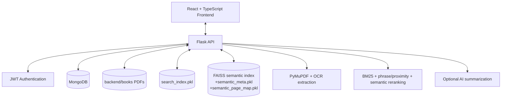
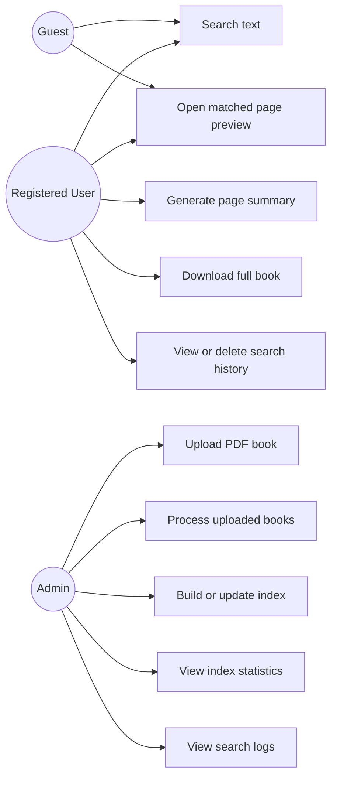

# Text Information Retrieval System

## Abstract
Text Information Retrieval System is a full-stack academic project designed to identify the source book and page for an arbitrary line, sentence, or paragraph of text. The backend uses a BM25-based positional inverted index as the primary candidate retriever, then applies phrase and proximity scoring together with semantic reranking using MiniLM embeddings and FAISS. The system stores uploaded PDFs on the server filesystem, extracts page text for indexing, and serves a single-page PDF preview so users can inspect the original page content safely. A Flask API, MongoDB persistence layer, and React frontend form the main application stack, while JWT-based authentication enables role-based workflows for guests, authenticated users, and administrators.

## 1. Introduction
The project focuses on classical information retrieval for book search. A user supplies a query fragment taken from a book, and the system returns the most relevant book, page number, and snippet. The design intentionally keeps BM25 as the retrieval baseline while enriching ranking with phrase proximity and semantic similarity.

### 1.1 Problem Statement
Searching a large collection of scanned or extracted book pages with exact keyword matching alone often produces noisy results. Users need a system that can recover the source page even when the query is partial, slightly reordered, or phrased differently from the original text.

### 1.2 Objectives
- Locate the source book and page from a text fragment.
- Return a relevant snippet and a safe preview of the original page.
- Support PDF ingestion, text extraction, indexing, and search history.
- Preserve existing data while allowing schema evolution.

### 1.3 Scope
The system supports uploaded PDF books, page-wise text extraction, search over a prebuilt index, page preview, optional AI summarization, and authenticated admin operations. It does not replace BM25 as the main retriever.

### 1.4 Design Principles
- Use extracted page text for indexing, ranking, and snippets.
- Use the original PDF page for preview.
- Prefer incremental rebuilds when possible.
- Keep frontend and backend separated.

## 2. System Overview
The application has three visible layers: React frontend, Flask backend, and MongoDB. The backend also maintains runtime artifacts on disk for the positional index and semantic vector search.

### Main Runtime Stores
- MongoDB collections for books, pages, users, search logs, and page chunks.
- `backend/books/` for uploaded PDFs.
- `backend/data/search_index.pkl` for the positional inverted index.
- `backend/data/semantic.index`, `backend/data/semantic_meta.pkl`, and `backend/data/semantic_page_map.pkl` for semantic search.

## 3. Architecture
The backend is organized into routes, services, models, config, and utility layers.



### 3.1 Backend Layers
- Routes: define HTTP endpoints and input validation.
- Services: implement ingestion, search, indexing, logging, and summaries.
- Models: define document defaults, schema helpers, and status constants.
- Utils: provide auth, storage, PDF, and response helpers.

### 3.2 Search Architecture
Search uses a two-stage retrieval path:
1. BM25 on the positional inverted index generates the candidate set.
2. Phrase/proximity boosts and semantic scores rerank those candidates.

The final response returns `book_id`, `title`, `page_id`, `page_number`, `score`, and `snippet`.

### 3.3 Preview Architecture
The page preview endpoint returns a single-page PDF generated from the source file. This avoids exposing the entire book PDF to anonymous users through the browser viewer.

## 4. Database Design
The codebase currently uses the following collections:

$$
\begin{array}{|c|l|}
\hline
\textbf{Collection} & \textbf{Purpose} \\
\hline
\texttt{books} & \text{Book metadata, file path, ingestion state, and download eligibility} \\
\hline
\texttt{pages} & \text{Page-wise extracted text used for retrieval and preview} \\
\hline
\texttt{page\_chunks} & \text{Semantic chunks for FAISS indexing} \\
\hline
\texttt{users} & \text{Authentication and role management} \\
\hline
\texttt{search\_logs} & \text{User search history and analytics} \\
\hline
\end{array}
$$

### 4.1 Schema Evolution Rule
The system preserves existing `books` and `pages` data and extends documents safely instead of dropping or renaming collections destructively.

### 4.2 Important Book Status Values

$$
\begin{array}{|l|}
\hline
\textbf{Status Value} \\
\hline
\texttt{uploaded} \\
\hline
\texttt{processed} \\
\hline
\texttt{indexed} \\
\hline
\end{array}
$$

## 5. Core Workflows

### 5.1 Upload Workflow
An administrator uploads a PDF using `POST /api/admin/upload`. The file is saved under the books storage directory and a `books` document is created with status `uploaded`.

### 5.2 Processing Workflow
The administrator triggers `POST /api/admin/process-books`. The backend extracts text page by page from uploaded PDFs, creates or updates `pages` documents, and marks books as `processed`.

### 5.3 Index Building Workflow
`POST /api/admin/index/build` builds or updates the positional index and the semantic chunk index. The positional index is stored as a pickle artifact, and the semantic layer is written to FAISS and metadata files.

### 5.4 Search Workflow
`POST /api/search` normalizes the query, retrieves candidates from the BM25 index, adds phrase and proximity boosts, checks semantic similarity, and returns the ranked pages. Search history is logged for authenticated users.

### 5.5 Page Preview Workflow
`GET /api/page/<page_id>` returns the stored page metadata and extracted text. `GET /api/page/<page_id>/pdf` returns a one-page PDF for safe preview.

### 5.6 History Workflow
Authenticated users can view, delete, or clear their own search history from `/api/history`.

## 6. Use Cases



### 6.1 Guest Use Case
The guest user enters a text fragment, receives matched book pages, and previews the original page content.

### 6.2 Registered User Use Case
A logged-in user performs the same search actions as a guest and additionally downloads the full PDF and manages personal search history.

### 6.3 Admin Use Case
An administrator uploads PDFs, processes them into page documents, builds the index, views statistics, and inspects search logs.

## 7. API Summary

### Public APIs
- `GET /api/health`
- `POST /api/search`
- `GET /api/page/<page_id>`
- `POST /api/page/<page_id>/summary`
- `GET /api/page/<page_id>/pdf`

### Authentication APIs
- `POST /api/auth/register`
- `POST /api/auth/login`
- `GET /api/auth/me`
- `POST /api/auth/logout`

### User APIs
- `GET /api/history`
- `DELETE /api/history/<log_id>`
- `DELETE /api/history`
- `GET /api/book/<book_id>/download`

### Admin APIs
- `POST /api/admin/upload`
- `POST /api/admin/process-books`
- `POST /api/admin/index/build`
- `GET /api/admin/index/stats`
- `GET /api/admin/books`
- `GET /api/admin/domains`
- `GET /api/admin/logs/search`

## 8. Example Use-Case Code
The following request examples show how the main use cases are invoked.

### 8.1 Search Request
```bash
curl -X POST http://127.0.0.1:5000/api/search \
  -H "Content-Type: application/json" \
  -d '{"query":"dynamic programming", "top_k": 5}'
```

### 8.2 Build Index Request
```bash
curl -X POST http://127.0.0.1:5000/api/admin/index/build \
  -H "Authorization: Bearer <token>"
```

### 8.3 Page Preview Request
```bash
curl http://127.0.0.1:5000/api/page/1_1/pdf --output page.pdf
```

## 9. Deployment and Runtime

### Docker Deployment
The repository includes a Docker Compose setup for running the frontend, backend, and supporting services together.

### Local Development
The backend runs with Python and Flask, while the frontend uses Vite. MongoDB must be available for persistence, and OCR support requires Tesseract plus Poppler on Windows.

### Runtime Files
Generated index artifacts and uploaded PDFs are runtime data and should not be committed to Git.

## 10. Testing and Validation
The system can be validated through the following checks:
- health endpoint verification
- book upload and processing flow
- index build and stats inspection
- search response ranking and preview rendering
- authenticated history storage and deletion

## 11. Conclusion
The project provides a practical text retrieval pipeline that combines classical IR, semantic reranking, PDF ingestion, and safe previewing. The architecture is modular enough to support future extensions such as richer chunking, alternate embedding models, or improved analytics without changing the public search workflow.

## Appendix A. Notes for Report Generation
If this markdown report is exported to PDF, the Mermaid blocks should be rendered or converted to images by the reporting tool. The current text intentionally mirrors a formal system report structure so it can be reused directly for submission or presentation.